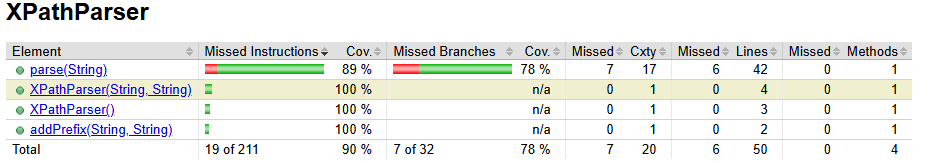
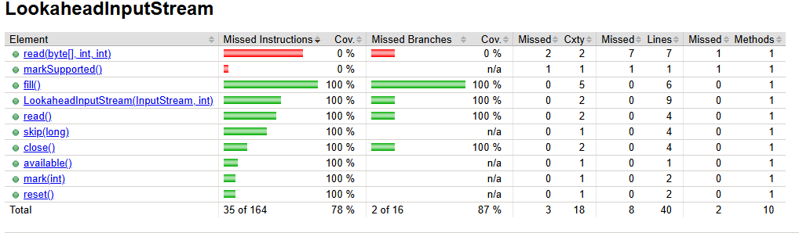

# IFT3913 – Tâche 2 : génération de tests par IA et analyse de mutation

**Auteurs :**

| Nom | Matricule | GitHub |
|---|---|---|
| Aguibou FOFANA | 20332292 | [@AguibouF](https://github.com/AguibouF) |
| Anas HARTI | 20223975 | [@ax23399](https://github.com/ax23399) |

Cas d'étude : [Apache Tika](https://github.com/apache/tika), module `tika-core`.
Classes étudiées :

- `org.apache.tika.sax.xpath.XPathParser` (classe A) ;
- `org.apache.tika.io.LookaheadInputStream` (classe B).

> **Étiquette IAg : Assisté par l'IA** (voir la [section 10](#10-déclaration-dutilisation-de-lia-générative)).

## Sommaire

1. [Classes à tester](#1-classes-à-tester)
2. [Installation de ChatUniTest dans le pipeline Maven](#2-installation-de-chatunitest-dans-le-pipeline-maven)
3. [Génération des tests](#3-génération-des-tests)
4. [Critique des tests générés : comparaison des oracles](#4-critique-des-tests-générés--comparaison-des-oracles)
5. [Analyse de mutation avec PIT](#5-analyse-de-mutation-avec-pit)
6. [Mutants détectés par les tests générés](#6-mutants-détectés-par-les-tests-générés)
7. [Tests ajoutés manuellement](#7-tests-ajoutés-manuellement)
8. [Exécution dans la GitHub Action](#8-exécution-dans-la-github-action)
9. [Reproduire les résultats](#9-reproduire-les-résultats)
10. [Déclaration d'utilisation de l'IA générative](#10-déclaration-dutilisation-de-lia-générative)

---

## 1. Classes à tester

Après le clone du dépôt Tika, on a construit le module et ses dépendances, depuis la racine du dépôt :

```bash
./mvnw clean install -am -pl :tika-core
```

Le build passe en 38,9 s. Le rapport JaCoCo est produit dans `tika-core/target/site/jacoco/index.html`.

### 1.1 Classe A : `XPathParser`

Rapport JaCoCo de la classe **`XPathParser`**, obtenu avec la suite de tests originale de `tika-core`, avant tout ajout de tests :



| Méthode | Instructions | Branches | Lignes manquées |
|---|---|---|---|
| `parse(String)` | 89 % | 78 % (7 sur 32 manquées) | 6 sur 42 |
| `XPathParser(String, String)` | 100 % | n/a | 0 |
| `XPathParser()` | 100 % | n/a | 0 |
| `addPrefix(String, String)` | 100 % | n/a | 0 |
| **Total** | **90 %** (19 sur 211 manquées) | **78 %** | **6 sur 50 (88 % couvertes)** |

On a choisi cette classe pour les raisons suivantes :

- **Elle a déjà des tests** (`XPathParserTest`, 7 tests), mais ils ne couvrent pas tout : **7 branches sur 32** de `parse` ne sont jamais prises.
- **La couverture surestime ce que vérifient ses propres tests.** JaCoCo mesure toute la suite de `tika-core`. Or `XPathParser` est aussi exécutée **indirectement** : `BodyContentHandler` crée un `new XPathParser("xhtml", XHTML)` dans un champ statique, ce qui exécute le constructeur à deux arguments sans qu'aucun test ne vérifie son effet. PIT, lui, n'exécute que les tests ciblés. Avec `XPathParserTest` seul, **40 lignes sur 50 (80 %)** sont couvertes, et le constructeur à deux arguments ne l'est pas du tout.
- **Elle a des mutants vivants.** Avec les tests originaux, PIT génère 32 mutants : **20 tués, 4 survivants et 8 non couverts**. Le score de mutation est de **63 %** (détail à la [section 5](#5-analyse-de-mutation-avec-pit)).
- **Sa logique est riche en branches.** `parse(String)` contient 16 conditions (une chaîne de 10 `if / else if` et des conditions imbriquées), soit 32 branches, avec de la récursion et une résolution de préfixes d'espace de noms. Chaque branche correspond à une forme d'expression XPath différente, c'est donc un bon terrain pour un générateur de tests.
- **Elle est déterministe et sans dépendance externe.** Elle transforme une chaîne en objet `Matcher`, sans entrée/sortie ni état global. Le code généré doit donc compiler et s'exécuter sans mocks complexes, et les oracles peuvent se vérifier en lisant le code.

Les méthodes ciblées sont `parse(String)`, qui contient toute la logique, et `addPrefix(String, String)`.

### 1.2 Classe B : `LookaheadInputStream`

`org.apache.tika.io.LookaheadInputStream` est une classe de flux qui permet de « regarder en avant » dans un `InputStream` : elle lit au plus *n* octets dans un buffer interne, puis rembobine le flux d'origine à sa fermeture. Elle est conçue pour les détecteurs de type, qui doivent lire le début d'un document sans le consommer. Dans le dépôt, elle est utilisée par l'exemple `EncryptedPrescriptionDetector` (`tika-example`). Rapport JaCoCo de la classe, obtenu avec la suite de tests originale de `tika-core`, avant tout ajout de tests :



| Méthode | Instructions | Branches | Lignes manquées |
|---|---|---|---|
| `read(byte[], int, int)` | **0 %** | **0 %** | 7 sur 7 |
| `markSupported()` | **0 %** | n/a | 1 sur 1 |
| `fill()`, constructeur, `read()`, `skip`, `close`, `available`, `mark`, `reset` | 100 % | 100 % | 0 |
| **Total** | **78 %** (35 sur 164 manquées) | **87 %** (2 sur 16 manquées) | **8 sur 40 (80 % couvertes)** |

On l'a choisie pour les raisons suivantes :

- **Elle a déjà des tests** (`LookaheadInputStreamTest`, 6 tests), mais ils ne couvrent pas tout. **2 des 10 méthodes comptées par JaCoCo ne sont jamais appelées** : `read(byte[], int, int)` et `markSupported()`. Elles concentrent les 8 lignes manquées. Ici, contrairement à la classe A, JaCoCo (toute la suite) et PIT (`LookaheadInputStreamTest` seul) donnent la même couverture de lignes, 32 sur 40 : la classe n'est pas exercée indirectement par d'autres tests.
- **Couverture à 100 % ne veut pas dire bien testé.** Le constructeur et `fill()` sont couverts à 100 % en lignes **et** en branches, et pourtant les 5 mutants survivants s'y trouvent (voir ci-dessous et la [section 6.2](#62-classe-b--lookaheadinputstream)).
- **Elle a des mutants vivants.** Avec les tests originaux, PIT génère 33 mutants : **19 tués, 5 survivants et 9 non couverts**. Le score de mutation est de **58 %**.
- **Elle est d'une nature différente de la classe A.** C'est une classe **avec état** (buffer, position, marque), qui fait de l'**arithmétique d'indices** et **interagit avec un autre objet**, le flux sous-jacent. Cela permet de voir comment l'IA s'en sort quand l'oracle dépend d'un état et d'effets de bord, et pas seulement d'une valeur de retour.
- **Elle reste abordable.** Elle fait 40 lignes et 8 méthodes publiques, et on peut la tester sans ressource externe, avec un simple `ByteArrayInputStream`.

## 2. Installation de ChatUniTest dans le pipeline Maven

**Modèle local avec Ollama**

1. On a installé Ollama depuis son site officiel.
2. On a téléchargé un modèle ouvert pris en charge par ChatUniTest :
   ```bash
   ollama pull codeqwen:v1.5-chat
   ```
3. On a lancé le serveur, qui écoute sur `http://127.0.0.1:11434` :
   ```bash
   ollama serve
   ```
4. On a vérifié que le modèle répond :
   ```bash
   ollama run codeqwen:v1.5-chat "Dis bonjour"
   ```

**Version de Java.** Le plugin ChatUniTest ne fonctionnait pas avec Java 26. La génération a donc été faite avec **Java 21**.

**Plugin Maven.** On a ajouté le plugin ChatUniTest dans `tika-core/pom.xml`. C'est un *plugin*, et non une dépendance : il se branche sur le modèle Ollama par son API compatible OpenAI.

```xml
<plugin>
  <groupId>io.github.zju-aces-ise</groupId>
  <artifactId>chatunitest-maven-plugin</artifactId>
  <version>2.1.1</version>
  <configuration>
    <apiKeys>ollama</apiKeys>
    <model>codeqwen:v1.5-chat</model>
    <url>http://127.0.0.1:11434/v1/chat/completions</url>
    <testNumber>1</testNumber>
    <maxRounds>2</maxRounds>
    <maxPromptTokens>6000</maxPromptTokens>
    <maxResponseTokens>1500</maxResponseTokens>
    <enableMultithreading>false</enableMultithreading>
    <temperature>0.2</temperature>
  </configuration>
</plugin>
```

Choix de configuration :

- `temperature = 0.2` rend la génération plus déterministe.
- `enableMultithreading = false` évite de saturer le modèle local.
- `maxRounds = 2` limite le nombre de cycles de réparation automatique, où ChatUniTest renvoie les erreurs de compilation au modèle.

## 3. Génération des tests

### 3.1 Classe A : `XPathParser`

**Commande**

```bash
mvn chatunitest:class -DselectClass=XPathParser
```

<!-- TODO : vérifier que c'est bien la commande utilisée (class ou method). -->

**Temps de génération.** Le dossier de travail de ChatUniTest pour ce run a été écrasé par le run de la classe B. Les temps ci-dessous sont donc reconstitués à partir du journal du serveur Ollama (`%LOCALAPPDATA%\Ollama\server.log`), qui enregistre l'heure de fin et la durée de chaque requête `POST /v1/chat/completions`.

| Phase | Durée | Requêtes au LLM |
|---|---|---|
| Tentatives précédentes, le même jour (abandonnées) | ≈ 54 min | 38, dont **27 en erreur** (HTTP 500) |
| Run final (tests retenus) | **≈ 15 min** | 5, dont 1 en erreur |

- **Tentatives précédentes.** Le journal ne dit pas quelle classe était visée, et aucun test de ces tentatives n'a été conservé. On y voit que plusieurs requêtes étaient envoyées **en parallèle** : jusqu'à 4 requêtes interrompues à la même seconde. Beaucoup ont atteint la limite de 5 minutes et ont été coupées. Le modèle local ne parvient pas à traiter plusieurs longues requêtes à la fois dans ce délai. C'est la raison d'être de la configuration finale, avec `enableMultithreading = false`.
- **Run final.** Sa durée est une estimation. Le journal donne l'heure de la dernière requête, mais pas le lancement de Maven. On a donc ajouté à la période des requêtes les quelque 2 min 30 s de démarrage de Maven et d'analyse de la classe mesurées pour la classe B. Les 5 requêtes au modèle totalisent **11 min 50 s** (de 41 s à 3 min 10 s chacune) : environ **80 % du temps de génération est passé à attendre le LLM**.

**Où sont les tests générés ?**

ChatUniTest les écrit dans `tika-core/chatunitest-tests/org/apache/tika/sax/xpath/`, en dehors de `src/test/java`. Maven ne les compile donc pas tant qu'on ne les déplace pas. Trois fichiers ont été générés :

| Fichier | Contenu |
|---|---|
| `XPathParser_addPrefix_0_0_Test.java` | 1 test (`testAddPrefix`) |
| `XPathParser_parse_1_0_Test.java` | 10 tests sur `parse` |
| `XPathParser_Suite.java` | une suite qui regroupe les deux classes |

**Compilent-ils et s'exécutent-ils sans intervention manuelle ?** **Non.** Voici les interventions qui ont été nécessaires.

| # | Intervention | Fichier(s) | Raison |
|---|---|---|---|
| 1 | Déplacer les tests dans `src/test/java/org/apache/tika/sax/xpath/` | les 3 | Maven ne compile pas `chatunitest-tests/` |
| 2 | Écarter `XPathParser_Suite` (archivé dans `tika-core/ift3913/tests-generes-ecartes/`) | Suite | Elle utilise le runner **JUnit 4** `@RunWith(JUnitPlatform.class)`. Les packages `org.junit.platform.runner`, `org.junit.platform.suite.api` et `org.junit.runner` (JUnit 4) sont absents du classpath de test du projet, qui utilise JUnit 5. Le fichier ne compile donc pas (vérifié avec `mvn test-compile`). De toute façon, JUnit 5 découvre les tests sans suite. |
| 3 | Ajouter l'en-tête de licence Apache | 2 fichiers de test | Le build Tika vérifie la présence de la licence dans chaque fichier source (RAT et Spotless `licenseHeader`). |
| 4 | Retirer les imports génériques (`org.mockito.*`, `org.junit.jupiter.api.*`) et les imports inutilisés (`HashMap`, `Map`…), et remettre les imports dans l'ordre attendu. On a aussi retiré, par propreté, les imports redondants de classes du même package. | 2 fichiers de test | Checkstyle (`AvoidStarImport`, `UnusedImports`) et Spotless (`removeUnusedImports`, `importOrder`) font échouer le build. |
| 5 à 9 | **Réécrire 5 oracles** dans `XPathParser_parse_1_0_Test` | 1 fichier | Ces 5 tests **échouent** : voir ci-dessous et la [section 4](#4-critique-des-tests-générés--comparaison-des-oracles). |

**Résultat avant la correction des oracles**

- `XPathParser_addPrefix_0_0_Test` : 1 test sur 1 passe.
- `XPathParser_parse_1_0_Test` : 5 tests sur 10 passent (50 %). Les échecs sont `testParseChild`, `testParseNamedElement`, `testParseNamedAttribute`, `testParseSubtree` et `testParseDescendantNode`, tous du type suivant :
  ```
  AssertionFailedError: expected: <ChildMatcher@4b41587d> but was: <ChildMatcher@4aebee4b>
  ```

Il fallait corriger ces échecs de toute façon : PIT refuse de lancer l'analyse si un test échoue, et l'énoncé exige que tous les nouveaux tests passent dans la GitHub Action. Chaque oracle a été remplacé par une vérification du comportement du `Matcher` renvoyé. Les corrections sont marquées `// IFT3913 correction #n` dans le code. La version d'avant correction est archivée dans `tika-core/ift3913/tests-avant-correction-oracles/`.

| # | Test | Oracle généré (faux) | Oracle corrigé |
|---|---|---|---|
| 1 | `testParseDescendantNode` | `assertEquals(new CompositeMatcher(...), result)` | le type est `CompositeMatcher`, `matchesText()` est vrai, `matchesElement()` est faux, et un enfant correspond à l'élément |
| 2 | `testParseNamedAttribute` | `assertEquals(new NamedAttributeMatcher(ns, "name"), result)` | correspond à `(ns, "name")`, pas à `(null, "name")` |
| 3 | `testParseChild` | `assertEquals(new ChildMatcher(null), result)` | `descend(...)` renvoie `ElementMatcher.INSTANCE` : l'état suivant n'est **pas** `null` comme l'IA le supposait |
| 4 | `testParseSubtree` | `assertEquals(new SubtreeMatcher(null), result)` | le type est `SubtreeMatcher`, et il ne correspond jamais à rien. Sans préfixe par défaut enregistré, `/element` vaut `FAIL`. |
| 5 | `testParseNamedElement` | `assertEquals(new NamedElementMatcher(ns, "element", null), result)` | bon espace de noms → `ElementMatcher.INSTANCE`, sinon `Matcher.FAIL` |

**Après correction, les 11 tests générés passent.**

**Bilan : 9 interventions manuelles** sur 3 fichiers générés.

- 4 sont de l'intégration au projet (déplacement, suite JUnit 4, licence, style).
- **5 sont des corrections d'oracles faux.** Dans ces cas, le modèle a produit une valeur attendue qui ne correspond pas au comportement réel du code.

### 3.2 Classe B : `LookaheadInputStream`

**Commande**, lancée avec Java 21 :

```bash
mvn chatunitest:class -DselectClass=LookaheadInputStream
```

La génération a duré **47 min 52 s** au total, sur un modèle local (`codeqwen:v1.5-chat`). ChatUniTest traite chaque méthode séparément, avec au plus 2 tours : une génération, puis une réparation à partir des erreurs.

**Temps par méthode.** Ils sont mesurés à partir des horodatages des fichiers de travail de ChatUniTest (`tmp/chatunitest-info/.../history*/method*/`, `error-message/`, `build/`) et du journal Ollama.

| Méthode | Tour 0 | Tour 1 (réparation) | Résultat | Durée | Requêtes au LLM |
|---|---|---|---|---|---|
| *démarrage Maven et analyse de la classe* | | | | 2 min 29 s | 0 |
| constructeur | ignoré par ChatUniTest | | aucun test | 0 s | 0 |
| `close()` | échec à l'exécution | échec à la compilation | ❌ | 2 min 12 s | 2 |
| `read()` | échec à la compilation | échec à la compilation | ❌ | 3 min 57 s | 2 |
| `read(byte[], int, int)` | ✅ compile et passe | | **3 tests** | 1 min 17 s | 1 |
| `skip(long)` | échec à la compilation | échec à la compilation | ❌ | 3 min 18 s | 2 |
| `available()` | échec à l'exécution | échec à l'exécution | ❌ | 2 min 33 s | 2 |
| `markSupported()` | ✅ compile et passe | | **1 test** | 34 s | 1 |
| `mark(int)` | échec à la compilation | échec à la compilation (1 délai dépassé) | ❌ | 12 min 50 s | 3 |
| `reset()` | échec à la compilation | échec à la compilation (2 délais dépassés) | ❌ | 18 min 44 s | 4 |
| **Total** | | | **2 méthodes sur 8** | **47 min 52 s** | **17** |

Ce que montrent ces temps :

- **Le LLM représente environ 90 % du temps.** Les 17 requêtes totalisent 43 min 7 s, entre 27 s et 5 min chacune.
- **Les délais dépassés coûtent très cher.** Trois requêtes ont atteint la limite de 5 minutes (`SocketTimeoutException` côté ChatUniTest, HTTP 500 côté Ollama) sans rien produire, soit 15 minutes perdues. `mark` et `reset` représentent à elles seules **66 % du temps** (31 min 34 s), pour aucun test utilisable.
- **Les requêtes s'allongent au fil du run.** Elles prennent entre 27 s et un peu plus de 2 min pour les 6 premières méthodes, puis entre 3 min 30 s et 5 min pour `mark` et `reset`, dès le tour 0. On n'a pas pu en établir la cause avec certitude.
- **Coût d'un test utile.** 4 tests valides en 47 min 52 s, soit **environ 12 minutes par test retenu**. En comparaison, les 5 tests manuels de la [section 7.2](#72-classe-b--lookaheadinputstream), qui tuent les 8 mutants que l'IA laissait vivants, ont demandé une analyse ciblée de chacun d'eux.

**Seules 2 méthodes sur 8 ont obtenu un test valide.** Les tentatives échouées sont archivées dans `tika-core/ift3913/chatunitest-lookahead-brut/tentatives-echouees/`. Les causes d'échec relevées sont les suivantes :

- **Symboles inventés ou non importés.** `ReflectionTestUtils` vient de Spring, qui n'est pas une dépendance du projet (`read()`). `java.lang.reflect.Field` est utilisé sans être importé (`skip`, `reset`). `when(stream).reset()` confond les deux syntaxes de Mockito (`when(stream.x()).thenReturn(...)` et `doNothing().when(stream).reset()`), et le compilateur ne trouve pas `reset()` sur `OngoingStubbing` (`close`).
- **Exceptions non déclarées**, par exemple `unreported exception java.lang.Exception` (`mark`).
- **Mauvaise compréhension de la classe.** Le modèle a supposé que `LookaheadInputStream` est un **décorateur qui délègue** au flux sous-jacent :
  - `Wanted but not invoked: stream.close()`, alors que la classe rembobine le flux (`reset()`) et ne le ferme jamais ;
  - `Wanted but not invoked: mockStream.available()`, alors que `available()` calcule `buffered - position` sur son propre buffer ;
  - `expected: <-5> but was: <0>`, parce que le modèle s'attendait à recevoir la valeur « bouchonnée » du mock.

  Cette hypothèse **contredit directement la Javadoc** de la classe, qui dit qu'elle « insulates the underlying stream from things like possible mark(), reset() and close() calls ». La réparation automatique n'a pas corrigé ce malentendu. Pour `available()`, la même erreur revient au 2e tour. Pour `close()`, la tentative de réparation introduit une erreur de compilation.

**Où sont les tests générés ?** Dans `tika-core/chatunitest-tests/org/apache/tika/io/` : `LookaheadInputStream_read_3_0_Test`, `LookaheadInputStream_markSupported_6_0_Test` et `LookaheadInputStream_Suite`.

**Interventions manuelles : 4.** Aucune ne touche un oracle.

| # | Intervention | Raison |
|---|---|---|
| 1 | Déplacer les 2 tests dans `src/test/java/org/apache/tika/io/` | Maven ne compile pas `chatunitest-tests/` |
| 2 | Écarter `LookaheadInputStream_Suite` | même runner JUnit 4 que pour la classe A |
| 3 | Ajouter l'en-tête de licence | RAT et Spotless |
| 4 | Remplacer les imports génériques (`org.mockito.*`, `org.junit.jupiter.api.*`, `static org.mockito.Mockito.*`…) par des imports explicites, et retirer l'import redondant de la classe testée (même package) | Checkstyle et Spotless |

Après ces 4 interventions, les **4 tests générés compilent et passent**.

## 4. Critique des tests générés : comparaison des oracles

Dans ce document, « tests originaux » désigne les tests écrits à la main par les développeurs de Tika : `XPathParserTest` pour la classe A et `LookaheadInputStreamTest` pour la classe B.

Les sous-sections 4.1 à 4.4 portent sur la classe A. La classe B est traitée en 4.5.

### 4.1 Nature de l'oracle : comportement observable ou identité d'objet

Les tests originaux interrogent le `Matcher` renvoyé sur ce qu'il fait. Selon les cas, ils combinent les questions suivantes :

- `matchesText()` ;
- `matchesElement()` ;
- `matchesAttribute(null, "name")`, `matchesAttribute(NS, "name")` et `matchesAttribute(NS, "eman")` ;
- `descend(...)`.

L'oracle décrit la **sémantique** de l'expression XPath, indépendamment de la classe concrète choisie par l'implémentation.

Les tests générés vérifient au contraire l'**identité de l'objet**, par exemple `assertEquals(new ChildMatcher(null), result)`. C'est l'erreur centrale :

- Aucune classe `Matcher` de Tika n'implémente `equals()`. `assertEquals` retombe donc sur `Object.equals`, c'est-à-dire la comparaison de références.
- L'IA a supposé une convention, des classes de données avec égalité structurelle, au lieu de lire le code.
- Dans trois cas, la valeur attendue est fausse même sur le fond. Dans `testParseChild` et `testParseNamedElement`, l'IA passe `null` comme état suivant, alors que `parse("")` renvoie `ElementMatcher.INSTANCE`. Dans `testParseSubtree`, elle passe aussi `null`, alors que l'état interne est `Matcher.FAIL` (voir la section 4.3).

**Conséquence.** Les 5 tests qui comparent un objet construit échouent systématiquement. Les 5 qui passent ne le font que parce qu'ils comparent des **singletons** (`TextMatcher.INSTANCE`, `NodeMatcher.INSTANCE`, `AttributeMatcher.INSTANCE`, `ElementMatcher.INSTANCE`, `Matcher.FAIL`), pour lesquels l'identité coïncide avec l'égalité.

### 4.2 Spécificité : oracles discriminants ou vérifications triviales

**Tests originaux.** Ils contiennent des cas négatifs bien choisis. Dans `testNamedAttribute` (`/@name`) :

- `matchesAttribute(null, "name")` doit être vrai, mais `matchesAttribute(NS, "name")` doit être faux. L'oracle distingue l'absence de préfixe de l'espace de noms `NS`.
- Le nom inversé `"eman"` vérifie que la comparaison porte bien sur le nom complet.

Ces oracles tuent des mutants : inverser une condition ou confondre nom et espace de noms fait échouer le test.

**Les 5 tests générés qui passaient sans modification** sont des vérifications quasi tautologiques. Par exemple, « `parse("/text()")` doit renvoyer `TextMatcher.INSTANCE` » recopie littéralement la ligne correspondante du `if`, sans rien vérifier du comportement du matcher.

- Ils ont une vraie valeur de **couverture**. Ils atteignent des branches que les tests originaux ne visitent pas : `/node()` et `///`.
- Ils ont aussi une vraie valeur de **détection de mutants**, puisqu'ils vérifient l'identité exacte du résultat (voir la [section 6](#6-mutants-détectés-par-les-tests-générés)).
- Mais ils ne vérifient rien au-delà de cette identité. Si `TextMatcher.matchesText()` était cassé, ils ne le verraient pas.

**`XPathParser_addPrefix_0_0_Test`** lit le champ privé `prefixes` par réflexion et vérifie le contenu de la map.

- Ce test passe, mais il est fragile et peu informatif : il vérifie qu'un `put()` a bien mis quelque chose dans une map, ce qui revient à recopier l'implémentation.
- Renommer le champ le casse sans qu'aucun bug n'ait été introduit.
- Les tests originaux, eux, ne testent jamais `addPrefix` directement. Ils l'exercent dans `setUp()`, puis vérifient son **effet observable** dans `testPrefixedAttribute` et `testPrefixedElement`. C'est la bonne approche, et elle couvre la même ligne de code.

### 4.3 Qualité du code généré

- **Réflexion inutile.** `XPathParser_parse_1_0_Test` appelle la méthode **publique** `parse` par réflexion (`getDeclaredMethod("parse", String.class)` puis `setAccessible(true)`). C'est inutile, et les échecs sont plus difficiles à lire, puisqu'une exception serait enveloppée dans une `InvocationTargetException`.
- **Code superflu.** `@ExtendWith(MockitoExtension.class)` est présent alors qu'aucun mock n'est utilisé, et la moitié des imports ne servent à rien.
- **Dépendance implicite au contexte.** Les tests générés n'enregistrent pas le préfixe `null`, contrairement à `XPathParserTest`. `//element` y vaut donc un sous-arbre qui ne correspond à rien. L'IA ne s'en est pas rendu compte : elle attendait `new SubtreeMatcher(null)`.

### 4.4 Synthèse

| Critère | Tests originaux (`XPathParserTest`) | Tests générés (ChatUniTest) |
|---|---|---|
| Type d'oracle | comportement (`matches*`, `descend`) | identité ou égalité d'objet |
| Oracles corrects sans intervention | 7 sur 7 | 6 sur 11 |
| Cas négatifs | oui, systématiques | non |
| Lignes couvertes (mesure PIT, sur la classe de test seule) | 80 % | 90 % (`/node()`, `///`, `//x` en plus) |
| Couplage à l'implémentation | faible | fort (réflexion sur champ privé et méthode publique) |
| Temps de génération | — | ≈ 15 min pour le run final (plus ≈ 54 min de tentatives abandonnées) |
| Score de mutation seul | 63 % | 88 %, **après** correction de 5 oracles |

### 4.5 Classe B : `LookaheadInputStream`

**Tests originaux.** Ils utilisent un vrai `ByteArrayInputStream` et vérifient deux choses :

- les octets lus à travers le lookahead (`'a'`, `'b'`, puis `-1` quand la limite est atteinte) ;
- **l'état du flux sous-jacent après `close()`** : on relit `'a'`, `'b'`, `'c'` directement sur le flux d'origine.

C'est ce second point qui exprime le contrat de la classe : regarder sans consommer.

**Tests générés.** Les deux tests valides reposent sur un **mock Mockito** d'`InputStream`.

| Test généré | Oracle | Critique |
|---|---|---|
| `testReadWithAvailableData` | le mock renvoie 5 pour `read(byte[],int,int)` ; on vérifie que `read(buffer, 0, 5)` renvoie 5 et que le mock a été appelé une fois | Le mock **n'écrit aucun octet** dans le buffer. L'oracle vérifie un **nombre** d'octets, jamais leur **contenu**. Un `read` qui ne copierait rien, ou copierait au mauvais endroit, passerait ce test. |
| `testReadWithNoAvailableData` | le mock renvoie -1 ; `read` renvoie -1 | Correct et discriminant pour la fin de flux. En revanche, la conséquence la plus importante de ce cas n'est pas vérifiée : quand le flux est épuisé, il est rembobiné. |
| `testReadWithException` | le mock lève `IOException` ; on vérifie qu'elle est propagée | Pertinent. C'est le seul test, généré ou original, qui couvre la propagation d'erreurs. |
| `testMarkSupported` | `assertTrue(markSupported())` | Trivial (la méthode fait `return true`), mais c'est la seule vérification de ce contrat. |

**Vérifications d'interaction plutôt que d'état.** Les `verify(mock, times(1)).read(...)` testent la manière dont la classe appelle le flux, c'est-à-dire l'implémentation, et non ce qu'elle produit. Les tentatives échouées montrent le même biais, en pire : l'IA a écrit des `verify(stream).close()` et `verify(mockStream).available()` fondés sur une hypothèse fausse, celle d'un décorateur qui délègue.

**Synthèse pour la classe B**

| Critère | Tests originaux | Tests générés |
|---|---|---|
| Méthodes couvertes | `read()`, `skip`, `mark`, `reset`, `close` | `read(byte[],int,int)`, `markSupported` |
| Type d'oracle | état, avec de vrais octets et le flux relu après `close()` | valeurs de retour et interactions avec un mock |
| Oracles corrects sans intervention | 6 sur 6 | 4 sur 4 (sur les 2 méthodes réussies) |
| Taux de réussite de la génération | — | 2 méthodes sur 8 |
| Temps de génération | — | 47 min 52 s (≈ 12 min par test retenu) |
| Score de mutation seul | 58 % | 33 % |
| Apport en combinaison | — | +6 mutants (58 % → 76 %) |

Contrairement à la classe A, les tests générés ici sont **complémentaires** des tests originaux et ne les remplacent pas : ils couvrent exactement les deux méthodes que les tests originaux ignoraient. Mais leurs oracles sont trop faibles pour tuer les mutants qui touchent au contenu copié (voir la section 6.2).

## 5. Analyse de mutation avec PIT

### 5.1 Ajout de PIT au projet

On a ajouté le plugin `pitest-maven` à `tika-core/pom.xml`, avec le plugin JUnit 5. La propriété `pit.label` range chaque exécution dans un sous-dossier séparé de `target/pit-reports/`.

```xml
<properties>
  <pit.label>original</pit.label>
</properties>
...
<plugin>
  <groupId>org.pitest</groupId>
  <artifactId>pitest-maven</artifactId>
  <version>1.30.0</version>
  <dependencies>
    <dependency>
      <groupId>org.pitest</groupId>
      <artifactId>pitest-junit5-plugin</artifactId>
      <version>1.2.3</version>
    </dependency>
  </dependencies>
  <configuration>
    <targetClasses>
      <param>org.apache.tika.sax.xpath.XPathParser</param>
      <param>org.apache.tika.io.LookaheadInputStream</param>
    </targetClasses>
    <targetTests>
      <param>org.apache.tika.sax.xpath.*Test</param>
      <param>org.apache.tika.io.LookaheadInputStream*Test</param>
    </targetTests>
    <mutators><mutator>DEFAULTS</mutator></mutators>
    <outputFormats><param>HTML</param><param>XML</param><param>CSV</param></outputFormats>
    <timestampedReports>false</timestampedReports>
    <reportsDirectory>${project.build.directory}/pit-reports/${pit.label}</reportsDirectory>
    <exportLineCoverage>true</exportLineCoverage>
    <threads>4</threads>
    <useClasspathJar>true</useClasspathJar>
  </configuration>
</plugin>
```

**Problème rencontré.** Lancé depuis un chemin qui contient des accents (`...\Qualité du logiciel et métriques\...`), PIT termine « avec succès », mais tous les mutants sont `NO_COVERAGE`. En mode verbeux (`-Dverbose=true`), le processus secondaire de PIT (le « minion ») affiche `ClassNotFoundException` pour chaque classe de test : il ne trouve pas `target/test-classes`. Ce sont bien les **accents** qui posent problème, et non les espaces : le même projet, atteint par un chemin avec des espaces mais sans accents, donne les bons résultats. Désactiver `useClasspathJar` ne change rien. On contourne le problème en créant un lecteur virtuel sans accents :

```bash
subst V: "C:\chemin\vers\le-depot"
```

On lance ensuite Maven depuis `V:\tika-core` (voir la [section 9](#9-reproduire-les-résultats)).

Pour analyser une seule classe à la fois, on restreint PIT en ligne de commande avec `-DtargetClasses=...` et `-DtargetTests=...` (voir la [section 9](#9-reproduire-les-résultats)).

### 5.2 Scores de mutation

#### Classe A : `XPathParser`

Il y a 32 mutants, générés par les opérateurs par défaut de PIT :

- 16 `RemoveConditional_EQUAL_ELSE` ;
- 13 `NullReturnVals` ;
- 2 `Math` ;
- 1 `VoidMethodCall`.

| Ensemble de tests | Lignes couvertes | Tués | Survivants | Non couverts | **Score de mutation** | Force des tests |
|---|---|---|---|---|---|---|
| Originaux (`XPathParserTest`) | 40/50 (80 %) | 20 | 4 | 8 | **63 %** | 83 % |
| ChatUniTest seuls (après correction des oracles) | 45/50 (90 %) | 28 | 1 | 3 | **88 %** | 97 % |
| Originaux et ChatUniTest | 45/50 (90 %) | 28 | 1 | 3 | **88 %** | 97 % |
| Originaux, ChatUniTest et manuels ([section 7](#7-tests-ajoutés-manuellement)) | **50/50 (100 %)** | **32** | 0 | 0 | **100 %** | 100 % |

Le score de mutation se calcule comme tués ÷ générés, et la force des tests comme tués ÷ couverts.

La colonne « Lignes couvertes » est la couverture mesurée par PIT avec les **seules classes de test ciblées**. Elle diffère donc de JaCoCo, qui exécute toute la suite de `tika-core` : 44 lignes sur 50 pour `XPathParser` (voir la [section 1.1](#11-classe-a--xpathparser)).

**Les tests générés ne détectent pas tous les mutants.** Il en reste 4 : 1 survivant et 3 non couverts. De plus, combiner les tests générés avec les tests originaux n'apporte aucun mutant supplémentaire : tout ce que tuent les tests originaux est aussi tué par les tests générés.

#### Classe B : `LookaheadInputStream`

Il y a 33 mutants :

- 8 `Math` ;
- 7 `VoidMethodCall` ;
- 5 `RemoveConditional_EQUAL_ELSE` ;
- 3 `RemoveConditional_ORDER_ELSE` ;
- 3 `ConditionalsBoundary` ;
- 6 `PrimitiveReturns` ;
- 1 `BooleanFalseReturnVals`.

| Ensemble de tests | Lignes couvertes | Tués | Survivants | Non couverts | **Score de mutation** | Force des tests |
|---|---|---|---|---|---|---|
| Originaux (`LookaheadInputStreamTest`) | 32/40 (80 %) | 19 | 5 | 9 | **58 %** | 79 % |
| ChatUniTest seuls | 28/40 (70 %) | 11 | 12 | 10 | **33 %** | 48 % |
| Originaux et ChatUniTest | 40/40 (100 %) | 25 | 8 | 0 | **76 %** | 76 % |
| Originaux, ChatUniTest et manuels | 40/40 (100 %) | **33** | 0 | 0 | **100 %** | 100 % |

**Les tests générés ne détectent pas tous les mutants**, même combinés aux tests originaux : il en reste 8. La couverture de lignes atteint 100 %, mais le score de mutation n'est que de 76 %. **Une couverture complète ne garantit donc pas des oracles suffisants.**

### 5.3 Détail par mutant

#### Classe A : `XPathParser`

| Ligne | Opérateur | Mutation | Original | ChatUniTest (test tueur) | Combiné |
|---|---|---|---|---|---|
| 48 | VoidMethodCallMutator | appel `addPrefix` retiré | NO_COVERAGE | NO_COVERAGE | NO_COVERAGE |
| 64 | RemoveConditionalMutator_EQUAL_ELSE | condition remplacée par `false` | KILLED | KILLED (testParseText) | KILLED |
| 65 | NullReturnValsMutator | valeur de retour remplacée par `null` | KILLED | KILLED (testParseText) | KILLED |
| 66 | RemoveConditionalMutator_EQUAL_ELSE | condition remplacée par `false` | SURVIVED | KILLED (testParseNode) | KILLED |
| 67 | NullReturnValsMutator | valeur de retour remplacée par `null` | NO_COVERAGE | KILLED (testParseNode) | KILLED |
| 68 | RemoveConditionalMutator_EQUAL_ELSE | condition remplacée par `false` | KILLED | KILLED (testParseFail) | KILLED |
| 69 | RemoveConditionalMutator_EQUAL_ELSE | condition remplacée par `false` | SURVIVED | SURVIVED | SURVIVED |
| 70 | NullReturnValsMutator | valeur de retour remplacée par `null` | NO_COVERAGE | KILLED (testParseDescendantNode) | KILLED |
| 72 | RemoveConditionalMutator_EQUAL_ELSE | condition remplacée par `false` | KILLED | KILLED (testParseAttribute) | KILLED |
| 73 | NullReturnValsMutator | valeur de retour remplacée par `null` | KILLED | KILLED (testParseAttribute) | KILLED |
| 74 | RemoveConditionalMutator_EQUAL_ELSE | condition remplacée par `false` | KILLED | KILLED (testParseEmpty) | KILLED |
| 75 | NullReturnValsMutator | valeur de retour remplacée par `null` | KILLED | KILLED (testParseEmpty) | KILLED |
| 76 | RemoveConditionalMutator_EQUAL_ELSE | condition remplacée par `false` | KILLED | KILLED (testParseNamedAttribute) | KILLED |
| 80 | RemoveConditionalMutator_EQUAL_ELSE | condition remplacée par `false` | KILLED | KILLED (testParseNamedAttribute) | KILLED |
| 82 | MathMutator | `+` remplacé par `-` | KILLED | KILLED (testParseNamedAttribute) | KILLED |
| 84 | RemoveConditionalMutator_EQUAL_ELSE | condition remplacée par `false` | KILLED | KILLED (testParseNamedAttribute) | KILLED |
| 85 | NullReturnValsMutator | valeur de retour remplacée par `null` | KILLED | KILLED (testParseNamedAttribute) | KILLED |
| 87 | NullReturnValsMutator | valeur de retour remplacée par `null` | NO_COVERAGE | NO_COVERAGE | NO_COVERAGE |
| 89 | RemoveConditionalMutator_EQUAL_ELSE | condition remplacée par `false` | KILLED | KILLED (testParseChild) | KILLED |
| 90 | NullReturnValsMutator | valeur de retour remplacée par `null` | KILLED | KILLED (testParseChild) | KILLED |
| 91 | RemoveConditionalMutator_EQUAL_ELSE | condition remplacée par `false` | SURVIVED | KILLED (testParseFail) | KILLED |
| 92 | NullReturnValsMutator | valeur de retour remplacée par `null` | NO_COVERAGE | KILLED (testParseFail) | KILLED |
| 93 | RemoveConditionalMutator_EQUAL_ELSE | condition remplacée par `false` | SURVIVED | KILLED (testParseSubtree) | KILLED |
| 94 | NullReturnValsMutator | valeur de retour remplacée par `null` | NO_COVERAGE | KILLED (testParseSubtree) | KILLED |
| 95 | RemoveConditionalMutator_EQUAL_ELSE | condition remplacée par `false` | KILLED | KILLED (testParseNamedElement) | KILLED |
| 97 | RemoveConditionalMutator_EQUAL_ELSE | condition remplacée par `false` | KILLED | KILLED (testParseSubtree) | KILLED |
| 103 | RemoveConditionalMutator_EQUAL_ELSE | condition remplacée par `false` | KILLED | KILLED (testParseNamedElement) | KILLED |
| 105 | MathMutator | `+` remplacé par `-` | KILLED | KILLED (testParseNamedElement) | KILLED |
| 107 | RemoveConditionalMutator_EQUAL_ELSE | condition remplacée par `false` | KILLED | KILLED (testParseNamedElement) | KILLED |
| 108 | NullReturnValsMutator | valeur de retour remplacée par `null` | KILLED | KILLED (testParseNamedElement) | KILLED |
| 111 | NullReturnValsMutator | valeur de retour remplacée par `null` | NO_COVERAGE | KILLED (testParseSubtree) | KILLED |
| 114 | NullReturnValsMutator | valeur de retour remplacée par `null` | NO_COVERAGE | NO_COVERAGE | NO_COVERAGE |

#### Classe B : `LookaheadInputStream`

| Ligne | Méthode | Mutation | Original | ChatUniTest (test tueur) | Combiné |
|---|---|---|---|---|---|
| 67 | constructeur | `if (stream != null)` → faux | SURVIVED | SURVIVED | SURVIVED |
| 68 | constructeur | appel `stream.mark(n)` retiré | SURVIVED | SURVIVED | SURVIVED |
| 74 | close | `if (stream != null)` → faux | KILLED | SURVIVED | KILLED |
| 75 | close | appel `stream.reset()` retiré | KILLED | SURVIVED | KILLED |
| 81 | fill | limite `buffered < length` → `<=` | SURVIVED | SURVIVED | SURVIVED |
| 81 | fill | `available() == 0` → faux | KILLED | KILLED (testReadWithNoAvailableData) | KILLED |
| 81 | fill | `stream != null` → faux | KILLED | KILLED (testReadWithNoAvailableData) | KILLED |
| 81 | fill | `buffered < length` → faux | KILLED | KILLED (testReadWithNoAvailableData) | KILLED |
| 82 | fill | `length - buffered` → `length + buffered` | SURVIVED | SURVIVED | SURVIVED |
| 83 | fill | `n != -1` → faux | KILLED | KILLED (testReadWithAvailableData) | KILLED |
| 84 | fill | `buffered += n` → `-=` | KILLED | KILLED (testReadWithAvailableData) | KILLED |
| 86 | fill | appel `close()` en fin de flux retiré | SURVIVED | SURVIVED | SURVIVED |
| 93 | read() | appel `fill()` retiré | KILLED | NO_COVERAGE | KILLED |
| 94 | read() | limite `buffered > position` → `>=` | KILLED | NO_COVERAGE | KILLED |
| 94 | read() | `buffered > position` → faux | KILLED | NO_COVERAGE | KILLED |
| 95 | read() | `0xff & b` → `0xff \| b` | KILLED | NO_COVERAGE | KILLED |
| 95 | read() | `position++` → `position--` | KILLED | NO_COVERAGE | KILLED |
| 95 | read() | retour → 0 | KILLED | NO_COVERAGE | KILLED |
| 97 | read() | retour -1 → 0 | KILLED | NO_COVERAGE | KILLED |
| 103 | read(byte[]) | appel `fill()` retiré | NO_COVERAGE | KILLED (testReadWithNoAvailableData) | KILLED |
| 104 | read(byte[]) | limite `buffered > position` → `>=` | NO_COVERAGE | KILLED (testReadWithNoAvailableData) | KILLED |
| 104 | read(byte[]) | `buffered > position` → faux | NO_COVERAGE | KILLED (testReadWithAvailableData) | KILLED |
| 105 | read(byte[]) | `buffered - position` → `+` | NO_COVERAGE | SURVIVED | SURVIVED |
| 106 | read(byte[]) | appel `System.arraycopy` retiré | NO_COVERAGE | SURVIVED | SURVIVED |
| 107 | read(byte[]) | `position += len` → `-=` | NO_COVERAGE | SURVIVED | SURVIVED |
| 108 | read(byte[]) | retour `len` → 0 | NO_COVERAGE | KILLED (testReadWithAvailableData) | KILLED |
| 110 | read(byte[]) | retour -1 → 0 | NO_COVERAGE | KILLED (testReadWithNoAvailableData) | KILLED |
| 116 | skip | appel `fill()` retiré | KILLED | NO_COVERAGE | KILLED |
| 118 | skip | `position += n` → `-=` | KILLED | NO_COVERAGE | KILLED |
| 119 | skip | retour → 0 | KILLED | NO_COVERAGE | KILLED |
| 124 | available | `buffered - position` → `+` | KILLED | SURVIVED | KILLED |
| 124 | available | retour → 0 | KILLED | SURVIVED | KILLED |
| 129 | markSupported | retour → `false` | NO_COVERAGE | KILLED (testMarkSupported) | KILLED |

## 6. Mutants détectés par les tests générés

### 6.1 Classe A : `XPathParser`

Les 28 mutants tués par les tests générés se répartissent en deux groupes :

- **11 mutants tués par les oracles d'origine** : les 5 tests « singleton » qui passaient sans modification.
- **17 mutants tués uniquement grâce aux 5 oracles réécrits.** Sans ces corrections, les tests échouaient et PIT ne pouvait même pas s'exécuter. **Une bonne partie de la valeur mesurée vient donc de l'intervention humaine.**

#### 6.1.1 Les 8 mutants que les tests originaux ne tuaient pas

| Ligne | Mutant | Test tueur | Pourquoi il est détecté |
|---|---|---|---|
| 66 | la condition `xpath.equals("/node()")` est remplacée par `false` | `testParseNode` | `/node()` n'est plus reconnu. Il tombe dans la branche `/nom`, avec `node()` comme nom et `null` comme préfixe, et ce préfixe n'est pas enregistré. `parse` renvoie `FAIL` au lieu de `NodeMatcher.INSTANCE`. `XPathParserTest` ne teste jamais `/node()`. |
| 67 | `return null` au lieu de `NodeMatcher.INSTANCE` | `testParseNode` | `assertEquals(NodeMatcher.INSTANCE, null)` échoue. La ligne n'était pas couverte par les tests originaux. |
| 70 | `return null` au lieu du `CompositeMatcher` de `/descendant::node()` | `testParseDescendantNode` | L'oracle corrigé appelle `result.matchesText()`, ce qui provoque une `NullPointerException`. `XPathParserTest` ne teste pas cette expression. |
| 91 | la condition `startsWith("///")` est remplacée par `false` | `testParseFail` | `///` tombe dans la branche `//` et devient un `SubtreeMatcher` au lieu de `Matcher.FAIL`. |
| 92 | `return null` au lieu de `Matcher.FAIL` pour `///` | `testParseFail` | `assertEquals(Matcher.FAIL, null)` échoue. |
| 93 | la condition `startsWith("//")` est remplacée par `false` | `testParseSubtree` | `//element` tombe dans la branche `/nom` avec un nom vide, et renvoie `FAIL`. L'oracle corrigé `assertInstanceOf(SubtreeMatcher.class, ...)` échoue. |
| 94 | `return null` au lieu du `SubtreeMatcher` | `testParseSubtree` | `assertInstanceOf` échoue sur `null`. |
| 111 | `return null` au lieu de `FAIL` quand le préfixe d'un élément est inconnu | `testParseSubtree` | `//element` construit `SubtreeMatcher(parse("/element"))`. Avec le mutant, l'état interne vaut `null`, et `result.matchesElement()` lève une `NullPointerException`. Ce mutant n'est détecté **que parce que** l'oracle corrigé interroge le comportement du résultat. |

#### 6.1.2 Les autres mutants, déjà tués par les tests originaux

| Lignes | Test généré tueur | Mécanisme |
|---|---|---|
| 64, 65 (`/text()`), 72, 73 (`/@*`), 74, 75 (chaîne vide) | `testParseText`, `testParseAttribute`, `testParseEmpty` | Oracles singleton. Sans la condition, l'expression tombe dans une autre branche qui renvoie `FAIL`. Avec `return null`, `assertEquals(X.INSTANCE, null)` échoue. |
| 68 | `testParseFail` | Le mutant fait entrer toute expression qui arrive à la ligne 68 dans la branche `/descendant::node()`. `///` renvoie alors un `CompositeMatcher` au lieu de `FAIL`. |
| 76, 80, 84, 85 | `testParseNamedAttribute` | Sans la branche `/@`, le préfixe devient `@ns`, qui est inconnu. Sans la détection du `:`, le préfixe devient `null`, qui n'est pas enregistré. Les deux cas renvoient `FAIL`, donc `assertInstanceOf(NamedAttributeMatcher)` échoue. Avec `return null`, l'oracle échoue aussi. |
| 82 (`colon + 1` devient `colon - 1`) | `testParseNamedAttribute` | Le nom extrait devient `s:name`, donc `matchesAttribute(ns, "name")` est faux. |
| 89, 90 (`/*`) | `testParseChild` | Sans la branche `/*`, `*` est lu comme un nom sans préfixe et donne `FAIL`. Avec `return null`, `assertInstanceOf` échoue. |
| 95, 103, 107, 108 | `testParseNamedElement` | Même mécanisme que pour les attributs, dans la branche `/nom`. |
| 105 (`colon + 1` devient `colon - 1`) | `testParseNamedElement` | Le nom devient `s:element`, donc `descend(ns, "element")` renvoie `FAIL` au lieu de `ElementMatcher`. |
| 97 (`slash == -1` remplacé par `false`) | `testParseSubtree` | `slash` reste à -1, et `substring(1, -1)` lève une `StringIndexOutOfBoundsException`. |

#### 6.1.3 Les 4 mutants non détectés par les tests générés

| Ligne | Mutant | Pourquoi il n'est pas détecté |
|---|---|---|
| 48 | l'appel à `addPrefix` est retiré du constructeur `XPathParser(prefix, ns)` | Ni `XPathParserTest` ni les tests générés n'appellent ce constructeur (`NO_COVERAGE`). ChatUniTest n'a produit que des tests qui utilisent le constructeur vide. JaCoCo l'indique pourtant couvert à 100 %, parce que `BodyContentHandler` l'exécute indirectement, mais aucun test ne vérifie son effet. C'est un bon exemple de **ligne couverte mais non testée**. |
| 69 | la syntaxe de compatibilité `/descendant:node()` n'est plus reconnue | Aucun test n'utilise la forme avec un seul `:`. La ligne est exécutée (évaluation du `\|\|`), mais le résultat n'est jamais vérifié pour cette entrée (`SURVIVED`). |
| 87 | `return null` au lieu de `FAIL` pour un attribut dont le préfixe est inconnu | Cas jamais testé (`NO_COVERAGE`). |
| 114 | `return null` au lieu de `FAIL` pour une expression sans `/` initial | Cas jamais testé (`NO_COVERAGE`). |

Ces 4 mutants sont tués par les tests manuels de la section suivante.

### 6.2 Classe B : `LookaheadInputStream`

Seuls, les tests générés tuent **11 mutants**. Combinés aux tests originaux, ils en tuent **6 nouveaux**, tous dans les méthodes que les tests originaux n'appelaient jamais :

| Ligne | Mutant | Test tueur | Pourquoi il est détecté |
|---|---|---|---|
| 103 | appel `fill()` retiré dans `read(byte[],…)` | `testReadWithNoAvailableData` | Sans `fill()`, le buffer reste vide et `read` renvoie -1 sans jamais appeler le mock. `verify(mockStream, times(1)).read(...)` échoue. C'est la vérification d'interaction qui tue ce mutant, pas la valeur de retour. |
| 104 | limite `buffered > position` → `>=` | `testReadWithNoAvailableData` | Le mock renvoie -1, donc `buffered = position = 0`. Avec `>=`, on entre dans la branche de copie et `read` renvoie `min(5, 0) = 0` au lieu de -1. |
| 104 | `buffered > position` → faux | `testReadWithAvailableData` | `read` renvoie toujours -1, au lieu des 5 attendus. |
| 108 | `return len` → `return 0` | `testReadWithAvailableData` | L'oracle `assertEquals(5, result)` voit 0. |
| 110 | `return -1` → `return 0` | `testReadWithNoAvailableData` | L'oracle `assertEquals(-1, result)` voit 0. |
| 129 | `return true` → `return false` | `testMarkSupported` | `assertTrue` échoue. |

Les tests générés tuent aussi, **seuls**, 5 mutants de `fill()` (ligne 81 : les trois conditions ; ligne 83 ; ligne 84). Les tests originaux les tuaient déjà. Par exemple, avec `buffered -= n`, `buffered` vaut -5, et `read` renvoie -1 au lieu de 5.

**Mutants non détectés par les tests générés, même combinés aux tests originaux (8)**

| Ligne | Mutant | Pourquoi il n'est pas détecté |
|---|---|---|
| 105 | `min(len, buffered - position)` → `buffered + position` | Dans les tests générés, `position` vaut toujours 0 au moment du `read(byte[],…)`, et `buffered - 0 = buffered + 0`. Il faudrait lire un octet **avant** l'appel pour distinguer les deux. |
| 106 | `System.arraycopy` retiré | Le mock n'écrit aucun octet, donc le buffer est vide dans tous les cas, et l'oracle ne regarde jamais le contenu de `buffer`. |
| 107 | `position += len` → `-=` | Aucun test ne lit après un `read(byte[],…)`. La position erronée n'est jamais observée. |
| 67, 68 | la marque n'est plus posée sur le flux sous-jacent à la construction | Les tests originaux construisent toujours le lookahead sur un flux **neuf**. Sa marque par défaut vaut déjà 0, donc `reset()` revient au bon endroit même sans `mark(n)`. |
| 81 (limite) | `buffered < buffer.length` → `<=` | Quand le buffer est plein, le mutant fait un `read(buf, length, 0)` supplémentaire. Ce n'est observable que si le flux sous-jacent est **exactement à sa fin** : il renvoie alors -1, ce qui déclenche un rembobinage prématuré. |
| 82 | `buffer.length - buffered` → `+` | Il faut au moins **deux** remplissages successifs. Or un `ByteArrayInputStream` renvoie tout d'un coup, et le mock renvoie 5 en une fois. |
| 86 | appel `close()` retiré en fin de flux | Quand le flux sous-jacent s'épuise avant la limite, la classe le rembobine **immédiatement**. Les tests originaux appellent ensuite `close()` explicitement, ce qui masque l'absence de rembobinage automatique. Le test généré `testReadWithNoAvailableData` atteint bien ce cas (le mock renvoie -1), mais ne vérifie pas que `reset()` est appelé sur le flux. |

## 7. Tests ajoutés manuellement

### 7.1 Classe A : `XPathParser`

Fichier : `tika-core/src/test/java/org/apache/tika/sax/xpath/XPathParserMutantsTest.java`

Après l'exécution de PIT avec les tests originaux et les tests ChatUniTest, 4 mutants de `XPathParser` n'étaient pas tués (lignes 48, 69, 87 et 114 : 1 survivant et 3 non couverts). Un test a été écrit pour chacun d'eux. Le `setUp` reprend la configuration de `XPathParserTest` : un préfixe `null` associé à l'espace de noms `null`, et le préfixe `"prefix"` associé à `"test namespace"`.

Résultat PIT avec les 4 classes de test : **32 mutants tués sur 32 (100 %)**, couverture de lignes 50/50.

#### A1. `testConstructorRegistersPrefix`

| | |
|---|---|
| **Mutant tué** | ligne 48, `VoidMethodCallMutator` : l'appel à `addPrefix(prefix, namespace)` est retiré du constructeur `XPathParser(String, String)` |
| **Intention** | Vérifier que le constructeur à deux arguments enregistre bien le préfixe, comme un appel explicite à `addPrefix`. |
| **Données** | `new XPathParser("prefix", NS)` puis `parse("/prefix:name")`. On utilise une instance **distincte** de celle du `setUp`, pour que le préfixe ne puisse venir que du constructeur. On emploie un nom préfixé, parce que la résolution d'un préfixe est le seul effet observable de `addPrefix`. |
| **Oracle** | Si le préfixe est enregistré, `parse` renvoie un `NamedElementMatcher`. Descendre dans `(NS, "name")` donne l'état final `ElementMatcher`, donc `matchesElement()` est vrai. Descendre dans `(null, "name")` donne `FAIL`, car l'espace de noms ne correspond pas. Avec le mutant, le préfixe est inconnu et `parse` renvoie `FAIL`, dont `descend` renvoie encore `FAIL`. La première assertion échoue alors. |

#### A2. `testDescendantNodeCompatibilitySyntax`

| | |
|---|---|
| **Mutant tué** | ligne 69, `RemoveConditionalMutator_EQUAL_ELSE` : la condition `xpath.equals("/descendant:node()")` est remplacée par `false` |
| **Intention** | Vérifier que l'ancienne syntaxe avec un seul deux-points, gardée « for compatibility » selon le commentaire du code, est interprétée comme `/descendant::node()`. |
| **Données** | La chaîne exacte `"/descendant:node()"`. Les tests originaux et ChatUniTest n'utilisent que la forme `::`. Seule cette variante exécute la seconde moitié du `||`. |
| **Oracle** | Même comportement attendu que `/descendant::node()`, déjà testé dans `XPathParserTest.testDescendantNode` : le nœud courant correspond au texte mais pas à l'élément, et tout descendant, à n'importe quelle profondeur, correspond à l'élément. Avec le mutant, l'expression tombe dans la branche `startsWith("/")`. Le nom `descendant:node()` y est lu comme le préfixe `descendant`, qui n'est pas enregistré, donc `parse` renvoie `FAIL` et `matchesText()` est faux. |

#### A3. `testAttributeWithUnknownPrefixFails`

| | |
|---|---|
| **Mutant tué** | ligne 87, `NullReturnValsMutator` : `return Matcher.FAIL` est remplacé par `return null` dans la branche des attributs `/@...` |
| **Intention** | Vérifier qu'un attribut dont le préfixe n'est pas enregistré donne un état d'échec, et non `null`. |
| **Données** | `"/@unknown:name"` : une expression d'attribut syntaxiquement valide, dont le préfixe `unknown` n'est pas déclaré dans le `setUp`. C'est la seule façon d'atteindre le `else` de la branche attribut. |
| **Oracle** | La Javadoc de `parse` dit : « Invalid expressions are not flagged as errors, they just result in a failing evaluation state ». Le résultat attendu est donc exactement la sentinelle `Matcher.FAIL`. On la vérifie avec `assertSame`, parce que `FAIL` est une instance unique et que `Matcher` ne définit pas `equals`. Le mutant renvoie `null`, ce qui fait échouer l'assertion. |

#### A4. `testExpressionWithoutLeadingSlashFails`

| | |
|---|---|
| **Mutant tué** | ligne 114, `NullReturnValsMutator` : le `return Matcher.FAIL` du `else` final est remplacé par `return null` |
| **Intention** | Vérifier qu'une expression relative, qui ne commence pas par `/`, n'est pas supportée et donne l'état d'échec. |
| **Données** | `"text()"` : proche d'une expression valide (`/text()`), mais sans la barre initiale. Elle n'est donc captée par aucune des branches précédentes et atteint le `else` final. |
| **Oracle** | Le parseur ne gère que des chemins absolus, et d'après la même Javadoc une expression invalide doit donner `Matcher.FAIL`. On le vérifie avec `assertSame(Matcher.FAIL, ...)`. Le mutant renvoie `null`. |

### 7.2 Classe B : `LookaheadInputStream`

Fichier : `tika-core/src/test/java/org/apache/tika/io/LookaheadInputStreamMutantsTest.java`

Il y a 5 tests pour les 8 mutants restants. Ils utilisent tous de vrais flux et vérifient des octets et l'état du flux sous-jacent, jamais des interactions.

Ils s'appuient sur une classe utilitaire, `OneByteAtATimeInputStream`. C'est un `ByteArrayInputStream` qui ne renvoie qu'**un octet par appel** à `read(byte[], int, int)`, comme un flux réseau, et qui valide ses bornes comme le contrat d'`InputStream` l'exige. Elle permet de provoquer plusieurs remplissages successifs du buffer.

Résultat PIT : **33 mutants tués sur 33 (100 %)**.

#### B1. `testCloseRewindsToPositionAtConstruction`

| | |
|---|---|
| **Mutants tués** | ligne 67 (`if (stream != null)` → faux) et ligne 68 (appel `stream.mark(n)` retiré) |
| **Intention** | Vérifier que `close()` ramène le flux sous-jacent à la position qu'il avait **au moment de la construction** du lookahead, et non au début du flux. |
| **Données** | Flux `{'a','b','c'}` dont on consomme d'abord `'a'`, puis lookahead de taille 2, qui lit `'b'` et `'c'`. Avancer le flux **avant** de le décorer est indispensable : sur un flux neuf, la marque par défaut (0) coïncide avec la bonne position, et le mutant est invisible. C'est pour cela qu'il survit aux tests originaux. |
| **Oracle** | La Javadoc de la classe garantit que le flux d'origine est marqué puis « reset to its original state » à la fermeture, c'est-à-dire à la position où le lookahead a commencé. Après `close()`, `stream.read()` doit donc renvoyer `'b'`. Sans `mark(n)`, `reset()` revient à la marque par défaut, 0, et renvoie `'a'`. |

#### B2. `testLookaheadWithPartialReads`

| | |
|---|---|
| **Mutant tué** | ligne 82 : `buffer.length - buffered` → `buffer.length + buffered` (nombre d'octets demandés au flux) |
| **Intention** | Vérifier que le lookahead fonctionne avec un flux qui renvoie ses données par morceaux, et que chaque remplissage ne demande que la place restante dans le buffer. |
| **Données** | `OneByteAtATimeInputStream` sur `{'a','b','c'}`, avec une limite de 2. Le premier `read()` remplit 1 octet. Le second déclenche un **deuxième** remplissage avec `buffered = 1`. C'est le seul cas où la soustraction et l'addition diffèrent. |
| **Oracle** | On attend `'a'`, `'b'`, puis -1 (limite atteinte), puis, après `close()`, `'a'` sur le flux d'origine (même contrat que les tests originaux). Avec le mutant, le deuxième remplissage demande 3 octets à partir de l'indice 1 d'un tableau de taille 2. Le flux lève `IndexOutOfBoundsException`, comme le prévoit le contrat d'`InputStream.read(byte[],int,int)`. |

#### B3. `testEndOfUnderlyingStreamRewindsIt`

| | |
|---|---|
| **Mutant tué** | ligne 86 : appel `close()` retiré quand le flux sous-jacent renvoie -1 |
| **Intention** | Vérifier que lorsque le flux d'origine est plus court que la limite, il est rembobiné **dès** que sa fin est atteinte, sans attendre l'appel explicite à `close()`. |
| **Données** | Flux `{'a','b'}` et limite de 3. Le flux s'épuise avant la limite, ce qui est la seule façon d'obtenir `n == -1` dans `fill()`. On n'appelle **pas** `close()`, contrairement à tous les tests existants, où cet appel masquait le mutant. |
| **Oracle** | Après `'a'`, `'b'`, puis -1, `stream.read()` doit renvoyer `'a'` : le flux a déjà été rembobiné par le `close()` interne. Avec le mutant, il reste à la fin et renvoie -1. |

#### B4. `testFullBufferDoesNotTouchUnderlyingStream`

| | |
|---|---|
| **Mutant tué** | ligne 81, `ConditionalsBoundaryMutator` : `buffered < buffer.length` → `buffered <= buffer.length` |
| **Intention** | Vérifier qu'une fois la limite atteinte, le lookahead ne lit plus rien dans le flux sous-jacent. |
| **Données** | Flux `{'a','b'}` et limite de **2** : le flux se termine **exactement** à la limite. Avec le mutant, un buffer plein déclenche `read(buf, 2, 0)`. Un `ByteArrayInputStream` épuisé renvoie alors -1, ce que la classe interprète comme la fin du flux, et elle le rembobine. Si le flux était plus long, ce même appel renverrait 0 et le mutant resterait invisible. |
| **Oracle** | Buffer plein, `close()` pas encore appelé : le flux d'origine doit rester à la position 2, et `stream.read()` doit renvoyer -1. Avec le mutant, il a été rembobiné et renvoie `'a'`. |

#### B5. `testReadIntoArrayAfterSingleByteRead`

| | |
|---|---|
| **Mutants tués** | ligne 105 (`buffered - position` → `+`), ligne 106 (appel `System.arraycopy` retiré) et ligne 107 (`position += len` → `-=`) |
| **Intention** | Vérifier que `read(byte[], off, len)` copie les octets disponibles **à partir de `off`**, en limite le nombre à ce qui reste dans le buffer, et avance la position. |
| **Données** | Flux `{'a','b','c'}` et limite de 2. Un premier `read()` consomme `'a'`, pour que `position = 1` (sinon `buffered - position` et `buffered + position` coïncident). Puis `read(b, 1, 3)` dans un tableau de 4 octets. On demande 3 octets alors qu'il n'en reste qu'1, et on utilise un `off` non nul pour vérifier l'emplacement. |
| **Oracle** | D'après le contrat d'`InputStream.read(byte[],int,int)`, il faut : un retour de **1** ; un tableau égal à `{0,'b',0,0}` (seule la case `off` est écrite) ; puis `read()` qui renvoie -1, puisque la limite de 2 est atteinte. Le mutant 105 copie 3 octets depuis un buffer de 2 et lève une exception. Le mutant 106 laisse le tableau vide. Le mutant 107 ramène la position à 0, et `read()` renvoie `'a'`. |

## 8. Exécution dans la GitHub Action

<!-- TODO : lien vers le workflow et vers une exécution réussie. -->

Nouveaux tests :

| Classe de test | Package | Tests | Origine |
|---|---|---|---|
| `XPathParser_addPrefix_0_0_Test` | `sax.xpath` | 1 | généré |
| `XPathParser_parse_1_0_Test` | `sax.xpath` | 10 | généré, 5 oracles corrigés |
| `XPathParserMutantsTest` | `sax.xpath` | 4 | ajouté manuellement |
| `LookaheadInputStream_read_3_0_Test` | `io` | 3 | généré |
| `LookaheadInputStream_markSupported_6_0_Test` | `io` | 1 | généré |
| `LookaheadInputStreamMutantsTest` | `io` | 5 | ajouté manuellement |

En local, `mvn test` passe avec Checkstyle, Spotless et RAT activés : **37 tests sur 37** pour les deux classes (en comptant les 13 tests originaux), et `BUILD SUCCESS`.

## 9. Reproduire les résultats

**Toutes les commandes de cette section se lancent depuis le dossier `tika-core`, et non depuis la racine du dépôt.** Lancé depuis la racine, PIT s'applique aux 124 modules de Tika et échoue dès le module `tika-annotation-processor` avec « No mutations found ». Depuis la racine du dépôt :

```bash
cd tika-core
```

**Seulement si le chemin du dépôt contient des accents.** Les commandes `mvn test` fonctionnent depuis n'importe quel dossier, mais **PIT ne fonctionne pas si le chemin contient des accents** (voir la section 5.1). Il termine alors par `BUILD SUCCESS`, mais avec `Ran 0 tests` et 0 mutant tué. Dans ce cas, avant de lancer PIT, on crée un lecteur virtuel sans accents et on se place dedans :

```bash
# à refaire après chaque redémarrage de Windows ; remplacer le chemin par celui du dépôt
subst V: "C:\chemin\vers\le-depot"
cd V:\tika-core
```

Les commandes ci-dessous se lancent alors depuis `V:\tika-core`.

Les options `-D` sont entre guillemets doubles : sinon PowerShell coupe `-Dsurefire.failIfNoSpecifiedTests=false` au premier point. Le `pom.xml` cible les deux classes : on précise donc `-DtargetClasses` pour analyser une classe à la fois.

Classe A :

```bash
# tests du package
mvn test "-Dtest=org.apache.tika.sax.xpath.*Test" "-Dsurefire.failIfNoSpecifiedTests=false"

# PIT : tests originaux seuls
mvn test-compile org.pitest:pitest-maven:mutationCoverage "-DtargetClasses=org.apache.tika.sax.xpath.XPathParser" "-DtargetTests=org.apache.tika.sax.xpath.XPathParserTest" "-Dpit.label=original"

# PIT : tests ChatUniTest seuls
mvn org.pitest:pitest-maven:mutationCoverage "-DtargetClasses=org.apache.tika.sax.xpath.XPathParser" "-DtargetTests=org.apache.tika.sax.xpath.XPathParser_addPrefix_0_0_Test,org.apache.tika.sax.xpath.XPathParser_parse_1_0_Test" "-Dpit.label=chatunitest"

# PIT : originaux et ChatUniTest
mvn org.pitest:pitest-maven:mutationCoverage "-DtargetClasses=org.apache.tika.sax.xpath.XPathParser" "-DtargetTests=org.apache.tika.sax.xpath.XPathParserTest,org.apache.tika.sax.xpath.XPathParser_addPrefix_0_0_Test,org.apache.tika.sax.xpath.XPathParser_parse_1_0_Test" "-Dpit.label=combine"

# PIT : tous les tests (originaux, ChatUniTest et manuels)
mvn org.pitest:pitest-maven:mutationCoverage "-DtargetClasses=org.apache.tika.sax.xpath.XPathParser" "-DtargetTests=org.apache.tika.sax.xpath.*Test" "-Dpit.label=complet"
```

Classe B :

```bash
# tests de la classe
mvn test "-Dtest=org.apache.tika.io.LookaheadInputStream*Test" "-Dsurefire.failIfNoSpecifiedTests=false"

# PIT : tests originaux seuls
mvn org.pitest:pitest-maven:mutationCoverage "-DtargetClasses=org.apache.tika.io.LookaheadInputStream" "-DtargetTests=org.apache.tika.io.LookaheadInputStreamTest" "-Dpit.label=lookahead-original"

# PIT : tests ChatUniTest seuls
mvn org.pitest:pitest-maven:mutationCoverage "-DtargetClasses=org.apache.tika.io.LookaheadInputStream" "-DtargetTests=org.apache.tika.io.LookaheadInputStream_read_3_0_Test,org.apache.tika.io.LookaheadInputStream_markSupported_6_0_Test" "-Dpit.label=lookahead-chatunitest"

# PIT : originaux et ChatUniTest
mvn org.pitest:pitest-maven:mutationCoverage "-DtargetClasses=org.apache.tika.io.LookaheadInputStream" "-DtargetTests=org.apache.tika.io.LookaheadInputStreamTest,org.apache.tika.io.LookaheadInputStream_read_3_0_Test,org.apache.tika.io.LookaheadInputStream_markSupported_6_0_Test" "-Dpit.label=lookahead-combine"

# PIT : tous les tests (originaux, ChatUniTest et manuels)
mvn org.pitest:pitest-maven:mutationCoverage "-DtargetClasses=org.apache.tika.io.LookaheadInputStream" "-DtargetTests=org.apache.tika.io.LookaheadInputStream*Test" "-Dpit.label=lookahead-complet"
```

### Rapports produits par PIT

**Déroulement d'une commande PIT.** Chaque commande `mutationCoverage` se déroule en trois étapes :

1. **Mesure de la couverture.** PIT exécute une première fois les tests indiqués par `-DtargetTests`, sans aucune mutation, pour savoir quelles lignes de la classe ciblée (`-DtargetClasses`) chaque test exécute.
2. **Génération des mutants.** PIT applique les opérateurs de mutation par défaut (`DEFAULTS`) au bytecode de la classe ciblée, par exemple en supprimant une condition ou en remplaçant une valeur de retour par `null`. Il obtient 32 mutants pour `XPathParser` et 33 pour `LookaheadInputStream`.
3. **Exécution des tests sur chaque mutant.** Pour chaque mutant, PIT ne relance que les tests qui couvrent la ligne modifiée. Le mutant est `KILLED` si au moins un test échoue, `SURVIVED` si tous passent, et `NO_COVERAGE` si aucun test n'exécute la ligne.

**Où vont les rapports.** La configuration de PIT dans `tika-core/pom.xml` (section 5.1) fixe l'emplacement et le format des rapports :

- `<reportsDirectory>${project.build.directory}/pit-reports/${pit.label}</reportsDirectory>` : chaque commande écrit dans `tika-core/target/pit-reports/<label>/`, où `<label>` est la valeur passée avec `-Dpit.label`. Les huit commandes de cette section produisent donc huit dossiers séparés : `original`, `chatunitest`, `combine`, `complet`, `lookahead-original`, `lookahead-chatunitest`, `lookahead-combine` et `lookahead-complet`.
- `<timestampedReports>false</timestampedReports>` : le dossier ne porte pas de date. Relancer une commande avec le même label **écrase** le rapport précédent.
- `<outputFormats>` : HTML, XML et CSV. `<exportLineCoverage>true</exportLineCoverage>` exporte en plus la couverture de lignes.

**Contenu d'un rapport.** Chaque dossier `target/pit-reports/<label>/` contient :

- **`index.html`** : la page à ouvrir dans un navigateur. Elle résume la couverture de lignes, le score de mutation et la force des tests. En cliquant sur la classe, on voit son code source : les lignes couvertes par les tests sont en vert, les lignes non couvertes en rouge, et chaque ligne est suivie de la liste de ses mutants avec leur résultat.
- **`mutations.xml`** et **`mutations.csv`** : la liste de tous les mutants, avec pour chacun la ligne de code, le type de mutation, le résultat (`KILLED`, `SURVIVED` ou `NO_COVERAGE`) et le test qui l'a tué. Les tableaux des sections 5.3 et 6 ont été construits à partir de ces fichiers.
- **`linecoverage.xml`** : quels tests exécutent quelles lignes. PIT s'en sert en interne ; il est rarement utile à la lecture.

Pour consulter un rapport, il suffit d'ouvrir par exemple `tika-core/target/pit-reports/original/index.html` dans un navigateur. Les chiffres affichés à la fin de chaque commande dans le terminal (par exemple `Generated 32 mutations Killed 20 (63%)` et `Line Coverage ... 40/50 (80%)`) sont ceux reportés dans les tableaux de la section 5.2.

**Remarques.**

- Les rapports sont dans `target/`, qui est ignoré par Git (`.gitignore`) et effacé par `mvn clean`. Ils ne sont donc pas versionnés : il faut relancer les commandes ci-dessus pour les régénérer.
- Si le chemin contient des accents, PIT produit quand même ces fichiers, mais avec tous les mutants en `NO_COVERAGE` (voir la section 5.1).

## 10. Déclaration d'utilisation de l'IA générative


Outre ChatUniTest (avec `codeqwen:v1.5-chat`), qui est l'objet même du travail, un assistant IA conversationnel (Claude, d'Anthropic) a servi à structurer ce document à partir des notes de l'équipe. Tous les résultats chiffrés proviennent d'exécutions réelles des outils.
